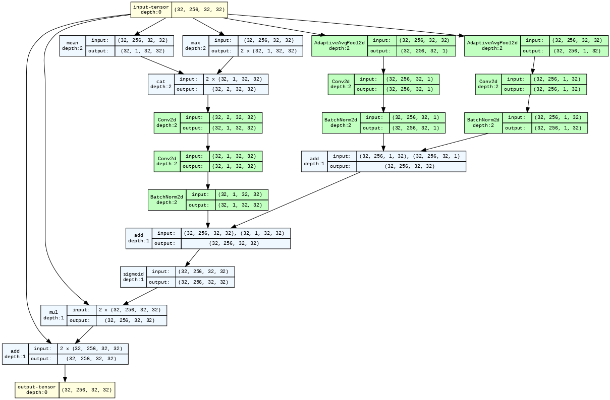

# carDNet

The proposed model, named carDNet, consists of two components: ResNet50 and an enhanced version of the attention net module. Our primary contribution is an improved attention module called CAM, or Convolutional Attention Module, designed to identify inter-class damage more efficiently. The CAM module comprises two parallel sub-modules: channel and spatial. After each residual block of the ResNet50 network, we have positioned the CAM module, which adaptively refines each incoming intermediate feature. Given an input intermediate feature map F ∈ R C×H×W as input, CAM simultaneously infers a spatial attention map Ms ∈ R 1×H×W , along with channel attention map Mc, which consists of a vertical-channel attention map Mcv ∈ R C×H×1 and a horizontalchannel attention map Mch ∈ R C×1×W as Illustrated in Figure . Then the CAM attention map M(F) is computed as, 

$$
M(F) = \sigma(M_s(F) + M_c(F))
$$

