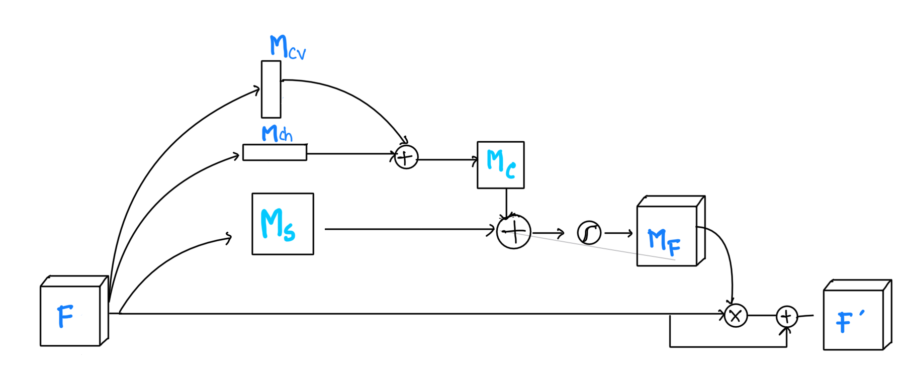

# carDNet

The proposed CarDNet model includes two main parts: ResNet50 and an upgraded version of the attention net module. The key innovation is a refined attention module known as CAM (Convolutional Attention Module), aimed at better detecting damage between different classes. CAM consists of two parallel sub-modules: one for channels and one for spatial features. Placed after each residual block in the ResNet50 network, the CAM module dynamically enhances each incoming intermediate feature.

$$
M(F) = \sigma(M_s(F) + M_c(F))
$$

